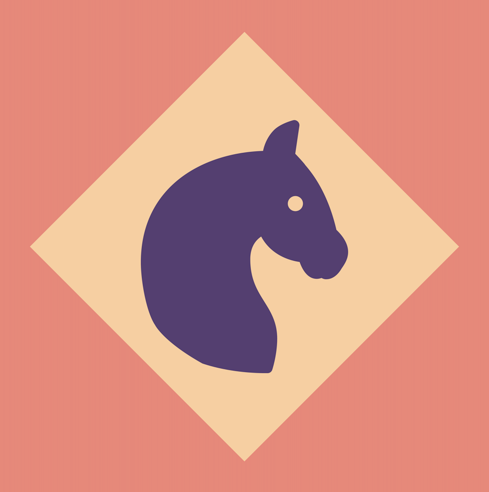
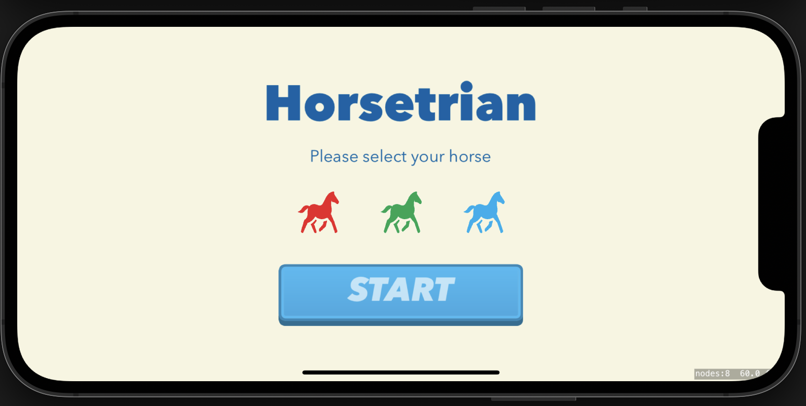
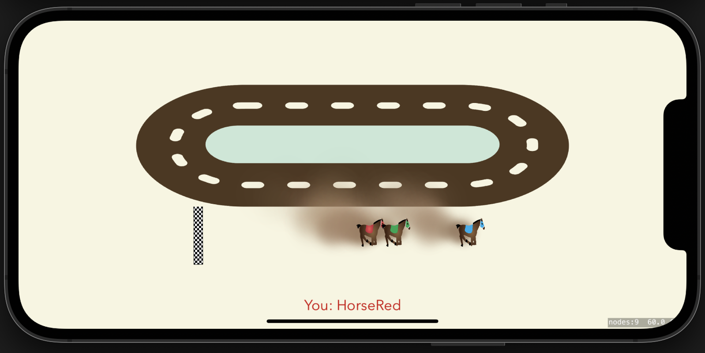
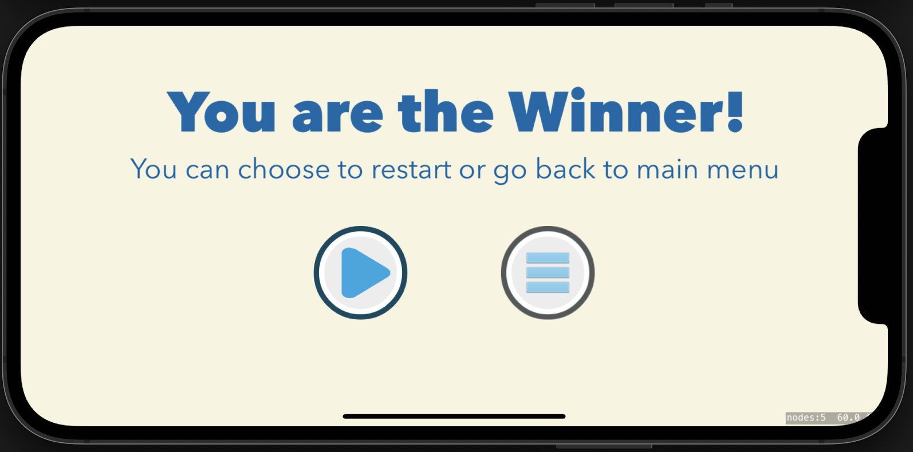

# Horsetrian 

Horestrain is an equestrian game of chance. It provides a thrilling experience
for those who love to test their luck now and then. A great game to play with 
your family & friends!

* **Choose** out of three beautiful horses.
* **Outcome** is truly random.
* **Works** only in landscape mode.
* **Includes** running animation for horses.
* **Includes** icon set for iphone and ipad.

## Technologies used in this project:

 

## User interface:

Provides an intuitive **menu** for selecting your favourite horse, with
error animations and sounds.

  

---

Works with **iphones** and **ipads** of any screen size.

  

---

provides a **won** scene if you are in luck.

  

---

provides a **lost** scene in those unfortunate scenarios.

  

## Note

Feel free to download the project and build upon it. You can add
new features, refactor the code if you'd like and improve 
the overall experience. Happy coding!